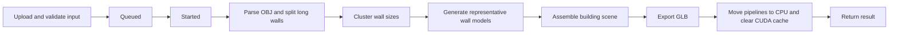
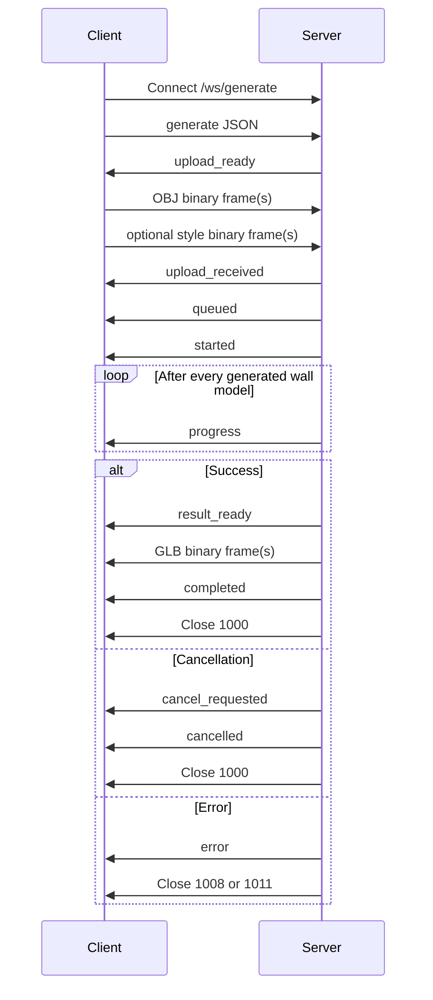

# 3D Building Facades Generation API

**Service implementation:** FastAPI + Uvicorn
**Output format:** binary glTF (`.glb`)

## Contents

1. [Overview](#1-overview)
2. [Architecture and request lifecycle](#2-architecture-and-request-lifecycle)
3. [Starting the server](#3-starting-the-server)
4. [Common generation parameters](#4-common-generation-parameters)
5. [REST API](#5-rest-api)
6. [WebSocket API](#6-websocket-api)
7. [Queueing and concurrency](#7-queueing-and-concurrency)
8. [Cancellation and shutdown behavior](#8-cancellation-and-shutdown-behavior)
9. [Progress reporting](#9-progress-reporting)
10. [Errors and close codes](#10-errors-and-close-codes)
11. [Logging](#11-logging)
12. [CUDA memory cleanup](#12-cuda-memory-cleanup)
13. [Client examples](#13-client-examples)
14. [Test client](#14-test-client)
15. [Docker and multi-GPU deployment](#15-docker-and-multi-gpu-deployment)
16. [Operational limits and security considerations](#16-operational-limits-and-security-considerations)
17. [Protocol compatibility checklist](#17-protocol-compatibility-checklist)

---

## 1. Overview

The service generates detailed 3D building exteriors from one or more mass models stored in an OBJ file. It exposes two transports:

| Transport | Health check | Generation | Progress | Client cancellation | Result |
|---|---:|---:|---:|:---:|---|
| REST/HTTP | `GET /health` | `POST /generate` | No | By disconnecting | One GLB HTTP response |
| WebSocket | `/ws/health` | `/ws/generate` | Yes | By disconnecting or `{"type":"cancel"}` message | Chunked binary frames |

Both transports use the same generation queue, generation parameters, model pipelines, cancellation checkpoints, and CUDA cleanup procedure.

The service does not currently implement authentication, authorization, rate limiting, persistent jobs, resumable uploads, or resumable downloads.

### Base URLs

For a server listening on port `8000`:

```text
HTTP:      http://127.0.0.1:8000
WebSocket: ws://127.0.0.1:8000
```

Use `https://` and `wss://` when TLS is terminated by a reverse proxy.

### FastAPI-generated documentation

The HTTP endpoints are automatically exposed through:

```text
GET /docs
GET /redoc
GET /openapi.json
```

WebSocket protocols are not represented by OpenAPI and are documented in this file.

---

## 2. Architecture and request lifecycle

A single server process runs one generation at a time. REST and WebSocket requests enter the same in-memory queue.

A typical request proceeds through these stages:



The generation worker runs in a thread so the event loop can continue to:

- monitor HTTP disconnects;
- receive WebSocket cancellation messages;
- send WebSocket progress messages;
- react to `SIGINT` and `SIGTERM`.

Cancellation is cooperative. It is checked at many stage boundaries, but a Python thread cannot forcibly interrupt an individual blocking Stable Diffusion or TRELLIS CUDA inference call. A cancellation that arrives during such a call takes effect after that call returns and the next cancellation checkpoint is reached.

---

## 3. Starting the server

Run the server through its own entry point:

```bash
python server.py --host 0.0.0.0 --port 8000
```

Arguments:

| Argument | Default | Description |
|---|---:|---|
| `--host` | `0.0.0.0` | Address on which Uvicorn listens. |
| `--port` | `8000` | TCP port. Must be between 1 and 65535. |

### Important: do not bypass the custom server class

The command below starts the FastAPI application, but bypasses the custom `CancellationAwareServer` signal handling:

```bash
uvicorn server:app
```

Use `python server.py ...` when you need the documented `SIGINT`/`SIGTERM` cancellation behavior.

---

## 4. Common generation parameters

REST form fields and WebSocket JSON parameters use the same names and defaults. `pixels_per_meter` and `cluster_count` are mandatory in both APIs.

### 4.1 Input and pipeline parameters

| Parameter | Type | Required | Default | Description |
|---|---|---:|---:|---|
| `output_filename` | string | No | `building.glb` | Filename advertised to the client. Directory components are removed and `.glb` is appended when missing. It does not select a server-side output directory. |
| `cluster_count` | integer | Yes | &mdash; | Number of representative wall models generated after clustering wall dimensions. Must be greater than zero. Higher values increase runtime and result quality. Progress `total` normally corresponds to this value. |
| `seed` | integer or null | No | `null` | Base random seed. Per-wall seeds are derived from it. `null` enables nondeterministic generation. |
| `temp_root` | path or null | No | `null` | Server-local parent directory for temporary files. `null` uses the operating-system temporary directory. Only trusted callers should be allowed to set server filesystem paths. |

### 4.2 Facade image generation parameters

| Parameter | Type | Default | Description |
|---|---|---:|---|
| `pixels_per_meter` | integer | Yes | &mdash; | Resolution used to render the facade semantic/control image. Must be greater than zero. Higher values increase image dimensions, runtime, and VRAM use. |
| `prompt` | string | `modern style architecture, urban house` | Positive text prompt used for facade image generation. |
| `negative_prompt` | string | `old, dark, distorted` | Negative text prompt. |
| `diffusion_steps` | integer | `30` | Number of Stable Diffusion denoising steps. Must be positive. |
| `guidance_scale` | float | `7.0` | Classifier-free guidance strength. |
| `cross_attention_scale` | float | `0.7` | LoRA cross-attention scale. |
| `controlnet_conditioning_scale` | float | `1.1` | ControlNet conditioning strength. |
| `control_guidance_start` | float | `0.0` | Fraction of diffusion at which ControlNet conditioning starts. |
| `control_guidance_end` | float | `1.0` | Fraction of diffusion at which ControlNet conditioning ends. |
| `style_ref_scale` | float | No | `0.5` | IP-Adapter strength. When no style image is provided, the effective value is forced to `0.0`. Must be non-negative. |

### 4.3 Facade wall mesh generation parameters

| Parameter | Type | Default | Description |
|---|---|---:|---|
| `max_wall_aspect_ratio` | float | No | `1.5` | Vertical quad faces at or above this width/height ratio are divided into congruent narrower faces. Must be greater than zero. |
| `slat_steps` | integer | `25` | Structured-latent sampler steps. Must be positive. |
| `slat_cfg_strength` | float | `3.0` | Structured-latent classifier-free guidance strength. |
| `border_size` | integer | `16` | Transparent border added around generated facade images before 3D generation. Must be non-negative. |
| `trellis_mode` | string | `multidiffusion` | TRELLIS multi-image generation mode. |

### 4.4 Mesh and texture parameters

| Parameter | Type | Default | Description |
|---|---|---:|---|
| `mesh_simplify` | float | `0.95` | Simplification value forwarded to TRELLIS GLB postprocessing. |
| `texture_size` | integer | `512` | Texture size requested from TRELLIS. Must be positive and, operationally, should be a power of two. |
| `texture_brightness_factor` | float | `1.4` | Multiplier applied to the generated base-color texture. Values are clipped to the 8-bit range. |
| `texture_postprocess_shrink_px` | integer | `4` | Number of pixels removed from each texture dimension by downsampling before texture-atlas packing. Applied only to power-of-two textures large enough to shrink. Must be non-negative. |
| `depth_scale_reference` | float | `32.0` | Reference used to scale generated wall depth during placement. Must be positive. |

### 4.5 Style-reference behavior

A style-reference image is optional.

- When provided, it is decoded with Pillow and converted to RGB.
- When omitted, IP-Adapter conditioning is disabled by setting the effective scale to `0.0`, regardless of the submitted `style_ref_scale`.
- The service does not enforce a specific filename extension or MIME type; decoding success is the effective validation.

### 4.6 Model-initialization configuration

These values are loaded from `default_configs.py` when the process imports the model module. They are not request parameters and cannot be changed through REST or WebSocket calls.

| Setting | Default | Purpose |
|---|---|---|
| `base_model` | `CompVis/stable-diffusion-v1-4` | Stable Diffusion base model. |
| `controlnet_id` | `lllyasviel/sd-controlnet-seg` | Segmentation ControlNet. |
| `lora_path` | `./aux/buildingface.safetensors` | Local facade LoRA weights. |
| `lora_adapter_name` | `buildingface` | Registered LoRA adapter name. |
| `ip_adapter_repository` | `h94/IP-Adapter` | IP-Adapter repository. |
| `ip_adapter_subfolder` | `models` | IP-Adapter repository subfolder. |
| `ip_adapter_weight_name` | `ip-adapter_sd15.bin` | IP-Adapter weights. |
| `trellis_model` | `microsoft/TRELLIS-image-large` | TRELLIS image-to-3D model. |

Runtime environment defaults are `ATTN_BACKEND=xformers` and `SPCONV_ALGO=native`; the module sets these environment variables before importing the GPU libraries. Changing model-initialization settings requires editing configuration and restarting the process.

---

## 5. REST API

## 5.1 Health check

```http
GET /health
```

Successful response:

```http
HTTP/1.1 200 OK
Content-Type: application/json
```

```json
{
  "status": "ok"
}
```

This endpoint checks that the web application is responsive. It does not perform a GPU inference or verify that enough VRAM is available for a new generation.

## 5.2 Generate a model

```http
POST /generate
Content-Type: multipart/form-data
```

### File fields

| Field | Required | Description |
|---|---:|---|
| `input_model` | Yes | OBJ mass model. The complete file is read into server memory. |
| `style_reference` | No | Optional image used by IP-Adapter. The complete file is read into server memory. |

All generation parameters from [Section 4](#4-common-generation-parameters) are submitted as multipart form fields.

### Minimal cURL request

```bash
curl --request POST http://127.0.0.1:8000/generate \
  --form 'input_model=@building.obj' \
  --form 'pixels_per_meter=32' \
  --form 'cluster_count=8' \
  --output building.glb
```

### Request with a style reference and parameter overrides

```bash
curl --request POST http://127.0.0.1:8000/generate \
  --form 'input_model=@building.obj' \
  --form 'style_reference=@style.png' \
  --form 'pixels_per_meter=32' \
  --form 'cluster_count=64' \
  --form 'output_filename=city_block.glb' \
  --form 'style_ref_scale=0.5' \
  --form 'texture_size=512' \
  --form 'texture_postprocess_shrink_px=4' \
  --output city_block.glb
```

### Successful response

```http
HTTP/1.1 200 OK
Content-Type: model/gltf-binary
Content-Disposition: attachment; filename="city_block.glb"
```

The response body is the complete GLB binary. Progress is not streamed through the REST endpoint.

### REST cancellation on disconnect

The server polls the connection every `0.25` seconds while the request is queued or running. When `Request.is_disconnected()` reports a lost connection, the cancellation token is set and generation stops at its next cancellation checkpoint.

Important details:

- Disconnect monitoring starts after the multipart files have been read.
- If the client is already gone, there is no HTTP response destination; cancellation is visible in server logs.
- If the request is cancelled from the server side while the client remains connected, the endpoint returns HTTP `503`.
- Cancellation does not necessarily interrupt the middle of a single blocking GPU inference call.

### REST status codes

| Code | Meaning |
|---:|---|
| `200` | Generation completed; response body is a GLB. |
| `400` | Empty upload, invalid style image, invalid generation data detected by the generation pipeline, or another client input error. |
| `422` | FastAPI/Pydantic request validation failure, such as a missing mandatory form field or an invalid field type. |
| `500` | Unexpected generation or cleanup failure. A traceback is logged server-side. |
| `503` | Request was cancelled while the client was still connected, typically by `SIGINT` or `SIGTERM`. |

Error responses generated by FastAPI/`HTTPException` use JSON, commonly:

```json
{
  "detail": "Generation was cancelled by SIGINT"
}
```

---

## 6. WebSocket API

## 6.1 WebSocket health check

Connect to:

```text
/ws/health
```

The server accepts the connection, sends one JSON message, and closes with WebSocket code `1000`:

```json
{
  "type": "health",
  "status": "ok"
}
```

## 6.2 WebSocket generation endpoint

Connect to:

```text
/ws/generate
```

One WebSocket connection is used for the complete operation:

1. Initial JSON request
2. Binary uploads
3. Queue and progress messages
4. Optional cancellation command
5. Result metadata
6. Binary GLB chunks
7. Completion or cancellation message
8. Connection close

### Protocol state diagram



## 6.3 Initial generation message

The first client message must be JSON with this structure:

```json
{
  "type": "generate",
  "parameters": {
    "pixels_per_meter": 32,
    "cluster_count": 64,
    "output_filename": "building.glb"
  },
  "input_model": {
    "filename": "building.obj",
    "size": 183912
  },
  "style_reference": null
}
```

With a style-reference image:

```json
{
  "type": "generate",
  "parameters": {
    "pixels_per_meter": 32,
    "cluster_count": 64,
    "output_filename": "building.glb",
    "style_ref_scale": 0.5
  },
  "input_model": {
    "filename": "building.obj",
    "size": 183912
  },
  "style_reference": {
    "filename": "style.png",
    "size": 68321
  }
}
```

Requirements:

- `type` must be exactly `generate`.
- `parameters.pixels_per_meter` must be a positive integer.
- `parameters.cluster_count` must be a positive integer.
- `input_model.size` must be a positive integer.
- `style_reference.size`, when present, must be a positive integer.
- Declared sizes must exactly match the binary data sent later.

## 6.4 Upload negotiation

After validating the initial JSON, the server sends:

```json
{
  "type": "upload_ready",
  "chunk_size": 4194304,
  "files": [
    "building.obj",
    "style.png"
  ]
}
```

`chunk_size` is the recommended frame size, currently 4 MiB. A client may send smaller frames. The server accumulates data until the declared size is reached.

### Binary upload order

The client must send raw binary frames in this exact order:

1. `input_model`, totalling exactly `input_model.size` bytes
2. `style_reference`, totalling exactly `style_reference.size` bytes, when declared

There is no separate per-chunk JSON header. File boundaries are determined exclusively by the declared sizes and order.

Do not place the end of one file and the beginning of the next file in the same WebSocket frame. The current receiver rejects a frame that causes the current file to exceed its declared size.

After all declared files are received, the server sends:

```json
{
  "type": "upload_received"
}
```

### Cancellation during upload

During binary upload, the only permitted text control message is:

```json
{
  "type": "cancel"
}
```

Any other text message during upload is treated as a client error.

## 6.5 Queue and start messages

After upload, the server places the request into the shared generation queue.

```json
{
  "type": "queued",
  "position": 2
}
```

`position` is one-based and includes the active request when one exists. Queue state is in memory and local to one server process.

When GPU processing begins:

```json
{
  "type": "started"
}
```

## 6.6 Progress messages

One progress message is sent after each representative wall model is generated and exported:

```json
{
  "type": "progress",
  "stage": "generating_wall_models",
  "completed": 3,
  "total": 64,
  "percent": 4.69
}
```

Fields:

| Field | Description |
|---|---|
| `stage` | Currently always `generating_wall_models`. |
| `completed` | Number of generated representative wall models. |
| `total` | Total representative wall models requested by clustering. |
| `percent` | `completed / total × 100`, rounded to two decimal places. |

This percentage covers the representative-wall generation loop only. It is not a precise percentage of total wall-clock time because parsing, clustering, scene assembly, GLB export, and cleanup are not assigned progress weights. Individual walls can also take different amounts of time.

## 6.7 Client cancellation

While queued or generating, send a JSON text message:

```json
{
  "type": "cancel"
}
```

The server sets the request cancellation token. When possible, it acknowledges the request immediately:

```json
{
  "type": "cancel_requested",
  "reason": "Generation was cancelled by the WebSocket client"
}
```

After the worker reaches a cancellation checkpoint and request-level CUDA cleanup completes, the server sends:

```json
{
  "type": "cancelled",
  "reason": "Generation was cancelled by the WebSocket client"
}
```

The server then closes the channel with code `1000`.

When cancellation is sent during the **file-upload phase**, the request terminates immediately with `cancelled` and a normal close; the separate `cancel_requested` acknowledgement is used by the queued/generation phase where the worker may need time to reach a checkpoint.

Only the first cancellation origin and reason are retained. For example, if a network disconnect is detected first and a signal arrives later, the request remains classified as a connection-drop cancellation.

### Control-message validation during generation

During generation, only JSON text control messages are accepted.

- `{"type":"cancel"}` requests cancellation.
- Unknown message types receive an `error` message with status `400`.
- Invalid JSON receives an `error` message with status `400`.
- Binary client messages during generation receive an `error` message with status `400`.

These control-message errors do not necessarily terminate an otherwise valid generation; the server continues listening unless cancellation or connection loss occurs.

## 6.8 Successful result transfer

When the GLB is ready, the server sends:

```json
{
  "type": "result_ready",
  "filename": "building.glb",
  "content_type": "model/gltf-binary",
  "size": 123456789,
  "chunk_size": 4194304,
  "chunk_count": 30
}
```

The server then sends the GLB as consecutive raw binary WebSocket frames, each at most 4 MiB. No JSON chunk index is sent between frames. The client must concatenate all binary frames in receive order.

After all binary data:

```json
{
  "type": "completed"
}
```

The server then closes the WebSocket with code `1000`.

Clients should verify that the number of accumulated binary bytes equals `result_ready.size` before accepting the file.

Chunking reduces the size of each WebSocket frame, but the current server still builds and stores the complete GLB byte string in memory before transmission.

## 6.9 WebSocket error message

Client and server failures use:

```json
{
  "type": "error",
  "status_code": 400,
  "detail": "Description of the error"
}
```

The channel is then closed:

- code `1008` for errors represented as 4xx;
- code `1011` for errors represented as 5xx.

## 6.10 WebSocket message reference

### Client to server

| Message | Phase | Purpose |
|---|---|---|
| `generate` JSON | First message | Defines parameters and upload sizes. |
| Binary frames | Upload | Carries OBJ and optional style-image bytes. |
| `cancel` JSON | Upload, queued, or generation | Requests cancellation. |

### Server to client

| Message | Purpose |
|---|---|
| `health` | WebSocket health response. |
| `upload_ready` | Initial message accepted; server is ready for binary files. |
| `upload_received` | All declared input bytes were received. |
| `queued` | Request entered the generation queue. |
| `started` | Request became active. |
| `progress` | One representative wall model completed. |
| `cancel_requested` | Cancellation token was set. |
| `cancelled` | Processing and cleanup terminated due to cancellation. |
| `result_ready` | Announces GLB metadata before binary frames. |
| Binary frames | GLB result chunks. |
| `completed` | All result bytes were sent. |
| `error` | Client or server failure. |

---

## 7. Queueing and concurrency

One server process permits one active generation. Every additional REST or WebSocket generation waits on the same asynchronous lock.

Properties of the current queue:

- in-memory only;
- local to one process;
- no persistence across restart;
- no maximum queue length;
- no job IDs;
- no REST queue-position response;
- WebSocket clients receive their initial queue position;
- queued requests can be cancelled by client disconnect, WebSocket cancellation, or a server signal.

CUDA cleanup is completed before the generation lock is released, so the next request does not begin until the previous request’s cleanup has finished.

---

## 8. Cancellation and shutdown behavior

## 8.1 Cancellation sources

| Source | Internal origin | REST behavior | WebSocket behavior | Log level |
|---|---|---|---|---|
| `SIGINT` / Ctrl+C | `server_signal` | `503` when connection exists | `cancel_requested`, then `cancelled`, then close | Warning |
| `SIGTERM` | `server_signal` | `503` when connection exists | `cancel_requested`, then `cancelled`, then close | Warning |
| WebSocket `cancel` | `client_cancel` | Not applicable | Cancellation sequence, then close | Info |
| HTTP connection loss | `connection_drop` | No response possible after loss | Not applicable | Info |
| WebSocket connection loss | `connection_drop` | Not applicable | No final message possible after loss | Info |
| Request-handler cancellation | `handler` | Handler cancellation propagates | Handler cancellation propagates | Warning |

## 8.2 Signal semantics

The custom Uvicorn server handles both `SIGINT` and `SIGTERM`.

### Signal while work exists

When an active or queued generation exists:

1. The active cancellation token is set.
2. Every queued cancellation token is set.
3. The server does **not** start process shutdown.
4. Active processing stops at the next cancellation checkpoint.
5. Queued requests terminate without starting generation.
6. CUDA cleanup runs for the active request.
7. The server remains available for new requests.

### Signal while idle

When no active or queued generation exists, the signal is delegated to Uvicorn and the process shuts down gracefully.

## 8.3 Cooperative-cancellation latency

Cancellation checks exist around major operations and between generated wall models. They do not forcibly interrupt a CUDA kernel or a blocking model call already running in the worker thread. Consequently, the observed cancellation delay can be approximately the remaining duration of the current Stable Diffusion or TRELLIS operation.

---

## 9. Progress reporting

Progress is available only through `/ws/generate`.

The callback fires after each representative wall model is generated and exported to the temporary wall store. At the same moment, the process writes this message to standard error:

```text
Generated wall model 3/64
```

No progress events are currently emitted for:

- upload percentage;
- OBJ parsing;
- wall clustering;
- scene assembly;
- texture-atlas packing;
- GLB export;
- CUDA cleanup;
- result-download percentage.

Clients can calculate download progress from accumulated binary bytes and `result_ready.size`.

---

## 10. Errors and close codes

### Input errors

Typical causes include:

- empty OBJ upload;
- empty optional style upload;
- malformed WebSocket initial JSON;
- non-positive required values;
- incorrect WebSocket declared file size;
- undecodable style image;
- OBJ without vertical wall faces;
- invalid generation configuration.

### Internal errors

Unexpected exceptions are wrapped with their original type and captured traceback. The server writes the traceback to the Uvicorn error logger and returns/sends a 500-class failure.

### Cleanup errors

CUDA cleanup runs in a `finally` block. If generation succeeds but cleanup fails, the request is treated as failed. If generation and cleanup both fail, both tracebacks are preserved in the server log.

### WebSocket close-code summary

| Code | Meaning in this service |
|---:|---|
| `1000` | Normal health completion, successful generation, or completed cancellation. |
| `1008` | Client/request error represented as status 4xx. |
| `1011` | Internal server error represented as status 5xx. |

---

## 11. Logging

The service uses the `uvicorn.error` logger and Uvicorn access logging.

### Request acceptance

A REST generation request is logged at INFO before FastAPI processes it:

```text
HTTP generation request accepted from 127.0.0.1:50234: "POST /generate"
```

This is implemented as pure ASGI middleware so it does not wrap or consume the request receive channel and therefore does not interfere with HTTP disconnect detection.

### Per-wall output

After every representative wall model:

```text
Generated wall model 3/64
```

This is written to `stderr` for both CLI and server generation.

### Cancellation logging

Server-side signal cancellation is logged at warning level:

```text
WebSocket generation request terminated: Generation was cancelled by SIGINT
```

Client/network cancellation is logged at info level:

```text
WebSocket generation request terminated: Generation was cancelled by the WebSocket client
```

```text
HTTP generation request terminated: HTTP client disconnected
```

### Failure logging

Unexpected errors include the full captured traceback. Input errors are normally logged as warnings without an internal-error traceback.

---

## 12. CUDA memory cleanup

After each complete active request-successful, failed, or cancelled-the coordinator calls `release_generation_memory()` once while still holding the generation lock.

The cleanup procedure:

1. Moves the Diffusers pipeline to CPU.
2. Moves the TRELLIS pipeline to CPU.
3. Runs Python garbage collection.
4. Calls `torch.cuda.empty_cache()`.
5. Calls `torch.cuda.ipc_collect()`.

Cleanup is request-scoped, not wall-scoped. It is intended to release transient allocations and recover from out-of-VRAM failures before the next queued request starts.

---

## 13. Client examples

## 13.1 Python REST client

```python
from pathlib import Path

import httpx

obj_path = Path("building.obj")

with httpx.Client(timeout=None) as client:
    response = client.post(
        "http://127.0.0.1:8000/generate",
        data={
            "pixels_per_meter": "32",
            "cluster_count": "64",
            "output_filename": "building.glb",
        },
        files={
            "input_model": (
                obj_path.name,
                obj_path.read_bytes(),
                "text/plain",
            )
        },
    )
    response.raise_for_status()
    Path("result.glb").write_bytes(response.content)
```

For very large responses, prefer `httpx.Client.stream(...)` and write chunks to disk rather than keeping another client-side copy in memory.

## 13.2 Python WebSocket client outline

```python
import asyncio
import json
from pathlib import Path

import websockets


async def main() -> None:
    obj = Path("building.obj").read_bytes()

    async with websockets.connect(
        "ws://127.0.0.1:8000/ws/generate",
        max_size=None,
        ping_interval=20,
        ping_timeout=20,
    ) as websocket:
        await websocket.send(
            json.dumps(
                {
                    "type": "generate",
                    "parameters": {
                        "pixels_per_meter": 32,
                        "cluster_count": 64,
                        "output_filename": "building.glb",
                    },
                    "input_model": {
                        "filename": "building.obj",
                        "size": len(obj),
                    },
                    "style_reference": None,
                }
            )
        )

        upload_ready = json.loads(await websocket.recv())
        chunk_size = upload_ready["chunk_size"]

        for offset in range(0, len(obj), chunk_size):
            await websocket.send(obj[offset : offset + chunk_size])

        assert json.loads(await websocket.recv())["type"] == "upload_received"

        output = bytearray()
        expected_size = None

        while True:
            message = await websocket.recv()

            if isinstance(message, bytes):
                output.extend(message)
                continue

            payload = json.loads(message)
            message_type = payload["type"]

            if message_type == "progress":
                print(payload["completed"], "/", payload["total"])

            elif message_type == "result_ready":
                expected_size = payload["size"]

            elif message_type == "completed":
                assert expected_size == len(output)
                Path("result.glb").write_bytes(output)
                break

            elif message_type in {"cancelled", "error"}:
                print(payload)
                break


asyncio.run(main())
```

### Sending a cancellation

The same connection can send this at any time after the initial request:

```python
await websocket.send(json.dumps({"type": "cancel"}))
```

A robust client should continue reading until it receives `cancelled` or the connection closes.

---

## 14. Test client

The source package includes [`api_test_client.py`](./test/api_test_client.py).

Install test-only dependencies:

```bash
pip install httpx websockets
```

Supported scenarios:

| Scenario | Purpose |
|---|---|
| `rest-health` | Test `GET /health`. |
| `rest-generate` | Generate and save a REST result. |
| `rest-disconnect` | Close the HTTP client during generation. |
| `rest-signal-cancel` | Send `SIGINT` to the server during a REST request. |
| `ws-health` | Test `/ws/health`. |
| `ws-generate` | Generate and save a WebSocket result. |
| `ws-cancel` | Send `cancel` after a chosen progress count. |
| `ws-disconnect` | Close the WebSocket during generation. |
| `ws-signal-cancel` | Send `SIGINT` during a WebSocket request. |

### Examples

REST generation:

```bash
python api_test_client.py rest-generate \
  --obj building.obj \
  --pixels-per-meter 32 \
  --cluster-count 64 \
  --output result.glb
```

WebSocket generation:

```bash
python api_test_client.py ws-generate \
  --obj building.obj \
  --pixels-per-meter 32 \
  --cluster-count 64 \
  --output result.glb
```

Cancel after two completed wall models:

```bash
python api_test_client.py ws-cancel \
  --obj building.obj \
  --cancel-after-progress 2
```

Drop the HTTP connection after five seconds:

```bash
python api_test_client.py rest-disconnect \
  --obj building.obj \
  --cancel-after-seconds 5
```

Send `SIGINT` to server process `12345`:

```bash
python api_test_client.py ws-signal-cancel \
  --obj building.obj \
  --server-pid 12345 \
  --cancel-after-seconds 5
```

Override additional parameters with inline JSON:

```bash
python api_test_client.py ws-generate \
  --obj building.obj \
  --parameters-json '{"texture_size":512,"style_ref_scale":0.4}'
```

`--parameters-json` may also point to a JSON file.

---

## 15. Docker and multi-GPU deployment

### One process per GPU

Each process owns global Diffusers and TRELLIS pipeline objects. The recommended multi-GPU layout is one server process per GPU:

```bash
CUDA_VISIBLE_DEVICES=0 python server.py --host 0.0.0.0 --port 8000
CUDA_VISIBLE_DEVICES=1 python server.py --host 0.0.0.0 --port 8001
```

Place a reverse proxy or caller-side load balancer in front of these instances.

Do not rely on `uvicorn --workers N` for GPU distribution: Uvicorn does not automatically pin each worker to a different GPU, and invoking Uvicorn directly also bypasses the custom signal-aware server entry point.

### Docker Compose sketch

This is a sketch of `docker-compose.yaml` file for multi-GPU usage. Real ready-to-work-with script can be found in [docker-compose.yaml](./docker-compose.yaml).

```yaml
services:
  facade-gpu-0:
    image: your-facade-image
    command: ["python", "server.py", "--host", "0.0.0.0", "--port", "8000"]
    environment:
      CUDA_VISIBLE_DEVICES: "0"
    ports:
      - "8000:8000"
    deploy:
      resources:
        reservations:
          devices:
            - capabilities: [gpu]

  facade-gpu-1:
    image: your-facade-image
    command: ["python", "server.py", "--host", "0.0.0.0", "--port", "8000"]
    environment:
      CUDA_VISIBLE_DEVICES: "1"
    ports:
      - "8001:8000"
    deploy:
      resources:
        reservations:
          devices:
            - capabilities: [gpu]
```

Exact GPU reservation syntax depends on the Docker Compose version and runtime configuration.

### Reverse-proxy considerations

For multi-hour WebSocket jobs:

- increase proxy read/write timeouts;
- permit WebSocket upgrades;
- avoid buffering WebSocket frames;
- allow large request bodies;
- keep ping/pong support enabled;
- route a WebSocket connection to one backend for its entire lifetime.

---

## 16. Operational limits and security considerations

### Memory behavior

The current implementation keeps several large objects in memory:

- REST uploads are read completely into bytes.
- WebSocket uploads are accumulated completely into bytes.
- The completed GLB is exported completely into a byte string.
- WebSocket chunking changes transport-frame size but does not reduce server peak memory for the completed GLB.

A multi-gigabyte output therefore requires sufficient system RAM in addition to GPU memory.

### No request-size limit in application code

The application does not impose explicit OBJ, style-image, or output-size limits. Configure limits in a trusted reverse proxy or add application-level validation when callers are not fully trusted.

### No authentication

All endpoints are unauthenticated. Do not expose the service directly to an untrusted network without an authentication/authorization layer.

### Server-local paths

`temp_root` is supplied by the client and interpreted as a path on the server. This is acceptable only for trusted callers. For an externally exposed API, remove this parameter from the public schema or restrict it to an administrator-controlled allowlist.

### Model and prompt abuse

Callers can change prompts and expensive sampler settings. Consider enforcing upper bounds on:

- `pixels_per_meter`;
- `cluster_count`;
- diffusion and TRELLIS steps;
- uploaded file sizes;
- queue length;
- total execution time.

### Reliability model

Jobs are tied to the live request/connection and are not persisted. A process restart loses active and queued work. The WebSocket result is not resumable.

### Health semantics

`/health` and `/ws/health` indicate application responsiveness only. They do not report:

- queue length;
- active request status;
- GPU temperature;
- free VRAM;
- model readiness after a failed initialization;
- downstream filesystem capacity.

---

## 17. Protocol compatibility checklist

A compatible REST client must:

- send `multipart/form-data`;
- include `input_model`, `pixels_per_meter`, and `cluster_count`;
- accept `model/gltf-binary` on success;
- allow a long or unlimited request timeout;
- handle `400`, `422`, `500`, and `503` JSON errors;
- close the connection to request cancellation.

A compatible WebSocket client must:

- send the `generate` JSON first;
- declare exact positive file sizes;
- wait for `upload_ready` before binary upload;
- send files in the declared order;
- not cross a file boundary inside one binary frame;
- continue reading progress while optionally sending `cancel`;
- distinguish JSON text messages from binary result frames;
- concatenate result frames in order;
- verify the final byte count against `result_ready.size`;
- treat `cancelled`, `error`, and connection closure as terminal states;
- disable or raise the library’s maximum incoming message size where necessary;
- use keepalive pings/timeouts suitable for multi-hour work.
