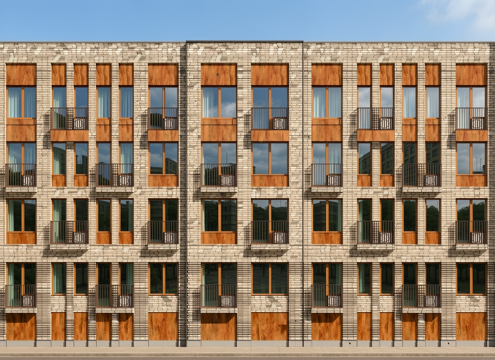
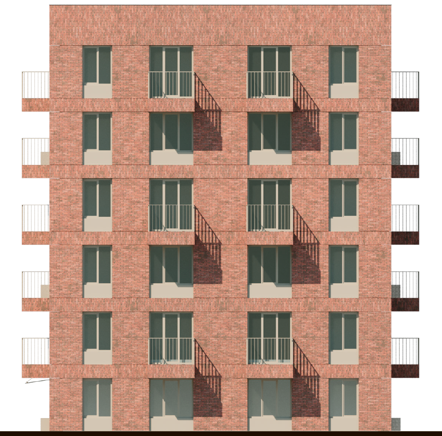

# More Visual Results

All scenes were generated with default prompt `"modern style architecture, urban house"` and default negative prompt `"old, dark, distorted"`.

Style reference images used: [this](./example_data/style1.png) with IP-Adapter scale of `0.6`:

and [this](./example_data/style2.png) with IP-Adapter scale of `0.4`:

---

Input scene: [`parallelepiped_grid`](./example_data/parallelepiped_grid.obj)

---

Input scene: [`hexagon`](./example_data/hexagon.obj)

---

Input scene: [`small_scene`](./example_data/small_scene.obj)

---

Input scene: [`tower`](./example_data/tower.obj)

---

Input scene: [`itmo`](./example_data/itmo.obj)

---

Input scene: [`etofhl`](./example_data/etofhl.obj)

---

Input scene: [`parallelepiped_grid`](./example_data/parallelepiped_grid.obj)

